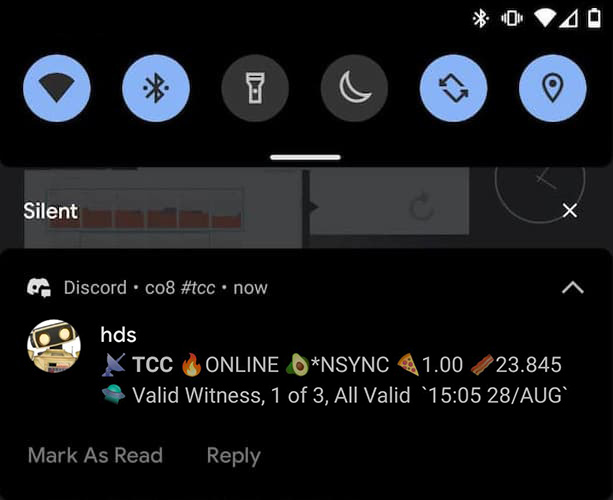

# HDS - Hotspot Discord Status

|         Discord Channel          |  Discord Mobile Notification   |
| :------------------------------: | :----------------------------: |
|  |  |

---

### Helium Hotspot Activity and Reward Notifications sent to your Discord Channel

**HDS monitors the Helium API for new activities**

[Bobcat 300 Miner](https://www.bobcatminer.com/) owners can add their local address and receive miner reports including status, temperature and OTA firmware versions.

#### Features

- Uses Helium API for latest hotspot activity
- Short, Concise Messages that mostly fit within a mobile notification
- Campy, Fun, and Full of Emojis
- Activities are displayed with Contextual Information for insights into performance, optimization and maintenance.
- Updated values are presented in **bold**
- **Wellness Check**: HDS will send a Status Message after 8 hours of no activities from the Helium API.

#### Bobcat Miner Integration

- Receive **Miner Reports** with more detailed stats directly from your miner locally via new Dashboard
- Miner Reports are sent every 72 hours, or by adding **report** as an argument
- Wellness Checks will also include a Miner Report

---

## Status Messages

**Welcome Message**:

:call_me_hand: THANKFUL COTTON CROCODILE [ :satellite: TCC ]

**Status Bar:**

:satellite: **TCC** :fire:ONLINE :avocado:\*NSYNC :pizza:1.00 :bacon:23.534

- :satellite: Hotspot Initials
- :fire: Online Status
- :avocado: Sync Status
- :pizza: Transmit/Reward Scale
- :bacon: Wallet Balance (of Hotspot Owner)

**Proof of Coverage**

- :game_die: Created Challenge... `16:57 23/AUG`
- :checkered_flag: ...Challenged Beaconer, 7 Witnesses `04:22 23/AUG`
- :volcano: Sent Beacon, 21 Witnesses, 18 Valid `13:29 23/AUG`
- :flying_saucer: Valid Witness, 1 of 4, All Valid `12:04 23/AUG`

**Invalid Witness**

- :poop: Invalid Witness, Too Close `12:12 23/AUG`
- :poop: Invalid Witness, RSSI BLB `10:55 25/AUG`

**Data Packet Transfer**

- :articulated_lorry: Transferred 4 Packets (8 DC) `04:39 24/AUG`

**HNT Amounts**

- :bacon:0.013
- :bacon:`0.0000032`

**Mining Rewards in :bacon:HNT**

- :cookie: Reward :bacon:0.013, Witness `04:31 23/AUG`
- :cookie: Reward :bacon:0.008, Challenger `04:31 23/AUG`
- :cookie: Reward :bacon:`0.0000032`, Data `04:48 24/AUG`
- :cookie: Reward :bacon:0.059, Beacon `01:42 24/AUG`

**Wellness Check plus Status Message**

`🚧 No Activities from API in the Last 8 Hours`  
:satellite: **TCC** :fire:ONLINE :avocado:\*NSYNC :pizza:1.00 :bacon:23.534

---

#### Bobcat Miner Report

[//]: # ":satellite: **TCC** :fire:ONLINE :avocado:*NSYNC :pizza:0.48 :bacon:11.245"

:nut_and_bolt::nut_and_bolt: **MINERity Report : 11:05 07/12/21** :nut_and_bolt::nut_and_bolt:  
Status: :white_check_mark: + :runner: Temp: :thumbsup: Height: :package: **944,112**  
Firmware: Helium **2021.08.16.0** | Bobcat **1.0.1.5**

- Status: Online and Running
- Temperature: Normal or XX°C
- Block Height: Direct from Miner
- OTA Firmware Versions: Helium and Bobcat

---

#### Prerequisites

- [Python v3.9+](https://www.python.org/downloads/)
- [How to Use Crontab, or other scheduler](https://www.geeksforgeeks.org/crontab-in-linux-with-examples/)
- [Install Discord Webhook for Python via pip3](https://pypi.org/project/discordwebhook/)
- [Have a Discord Account](https://support.discord.com/hc/en-us/articles/360033931551-Getting-Started)
- [Make a Discord Channel and Webhook](https://support.discord.com/hc/en-us/articles/228383668-Intro-to-Webhooks)

---

#### Installation

Option A: Download from Github

- Download Latest https://github.com/co8/hds/archive/refs/heads/master.zip
- rename/copy new-config.json to config.json
- rename/copy new-activity_history.json to activity_history.json
- edit config.json

Option B: Clone from Github

```BASH
git clone https://github.com/co8/hds
cd ~/hds
cp new-config.json config.json
cp new-activity_history.json activity_history.json
nano config.json
```

---

#### Config File. Add your Hotspot, Discord Bot Webhook

required

```json
{
  "hotspot": "HOTSPOT_ADDRESS_HERE",
  "discord_webhook": "DISCORD_WEBHOOK_HERE"
}
```

example

```json
{
  "hotspot": "112MWdscG3DjHTxdCrtuLk...",
  "discord_webhook": "https://discord.com/api/webhooks/878693306043871313/C6m7znYe..."
}
```

optional config values that can be customized

```json
{
  "bobcat_local_endpoint": "http://192.168.1.120/",
  "wellness_check_hours": 8,
  "report_interval_hours": 72
}
```

**FYI:** Bobcat Miner Reports slow down the miner. Do not abuse

---

#### Crontab

- Edit Cron:

```BASH
crontab -e
```

- Required:
  - run script every minute. log to file

```BASH
*/1 * * * * cd ~/hds; python3 hds.py >> cron.log 2>&1
```

- Optional:
  - run at reboot, if needed. eg: dedicated device
  - clear log file once a week at Sunday, 04:20am. write to cron.log
  - update from github nightly at 04:20am. write to cron.log

```BASH
@reboot cd ~/hds; printf "\n$(date "+%H:%M %D") Cron Reboot\n" >> cron.log 2>&1; python3 hds.py >> cron.log 2>&1
20 4 * * 0 cd ~/hds; rm cron.log; printf "\n$(date "+%H:%M %D") cron log cleared\n" >> cron.log 2>&1
20 4 * * * cd ~/hds; printf "\n$(date "+%H:%M %D") cron git update\n" >> cron.log; git fetch; git pull >> cron.log 2>&1
```

---

#### Run in Command Line

```BASH
cd ~/hds
python3 hds.py
```

#### Command line Arguments

```BASH
python3 hds.py reset
```

- resets by removing non-essential config values and clearing activity history

```BASH
python3 hds.py report
```

- sends a bobcat miner report, if bobcat_local_endpoint is set in config.json

---

#### Support this Project

Fork this project and submit pull requests

`If you find this project useful please consider supporting it`

HNT: [14hriz8pmxm51FGmk1nuijHz6ng9z9McfJZgsg4yxzF2H7No3mH](https://explorer.helium.com/accounts/14hriz8pmxm51FGmk1nuijHz6ng9z9McfJZgsg4yxzF2H7No3mH)

#### Seeking Grants and Bounties

I'm seeking grants and bounties for new projects and to improve and expand this project. [e@co8.com](mailto:e@co8.com)

---

#### Optional Hardware

For convenience, I run this script on a Raspberry Pi Zero W

[**Raspberry Pi Zero W** Kit (Amazon US)](https://amzn.to/3jWaUpF)

---

### Check out my other Helium Project...

#### ACM - Antenna Cap Mount

#### for Rak, Oukeione and Outdoor Fiberglass Dipole Antennas

#### Outdoor or Attic

https://www.thingiverse.com/thing:4942377


