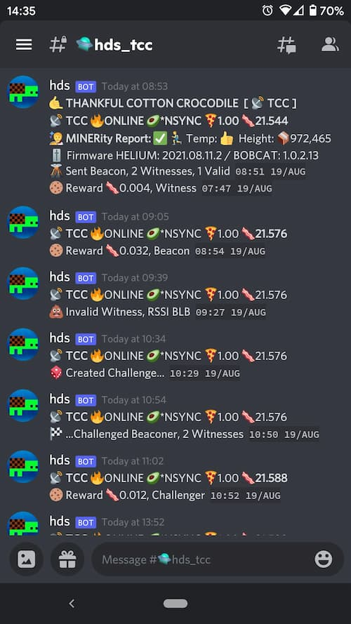
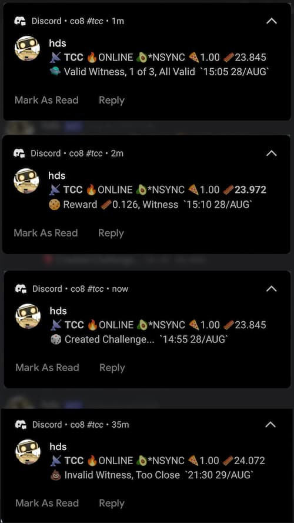
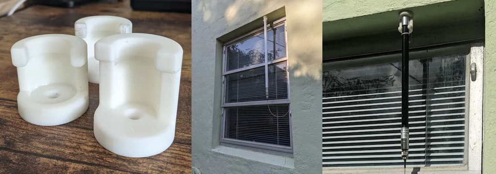

# HDS - Hotspot Discord Status

|         Discord Channel          |  Discord Mobile Notifications   |
| :------------------------------: | :-----------------------------: |
|  |  |

---

### Helium Hotspot Activity and Reward Notifications sent to your Discord Channel

**Listed as a Helium Community Tool** [https://explorer.helium.com/tools](https://explorer.helium.com/tools)

[Bobcat 300 Miner](https://www.bobcatminer.com/) owners can add their local address and receive miner reports via the [Bobcat Diagnoser](https://www.bobcatminer.com/post/bobcat-diagnoser-user-guide) including status, temperature and OTA firmware versions.

#### Features

- Uses [Helium Blockchain API](https://docs.helium.com/api/blockchain/introduction/)
- Python + Crontab
- Short, Concise Messages that mostly fit within a mobile notification
- Campy, Fun, and Full of Emojis
- Activities are displayed with Contextual Information for insights into performance, optimization and maintenance.
- Updated values are presented in **bold**
- **Wellness Check**: HDS will send a Status Message after 12 hours of no activities from the Helium API.

#### Bobcat Miner Integration

- Receive **Miner Reports** with more detailed stats directly from your miner locally via new Dashboard
- Miner Reports are sent every 72 hours, or by adding **report** as an argument
- Wellness Checks will also include a Miner Report

---

## Status Messages

**Welcome Message**:

:call_me_hand: THANKFUL COTTON CROCODILE [ :satellite: TCC ]

**Status Bar:**

:satellite: **TCC** :fire:ONLINE :avocado:\*NSYNC :pizza:1.00 :bacon:23.534

- :satellite: Hotspot Initials
- :fire: Online Status
- :avocado: API Sync Status or Block Gap. Are you [\*NSYNC](https://en.wikipedia.org/wiki/NSYNC)?
- :pizza: Transmit/Reward Scale
- :bacon: Wallet Balance (of Hotspot Owner)

**Proof of Coverage**

- :game_die: Created Challenge... `16:57 23/AUG`
- :checkered_flag: ...Challenged Beaconer, 7 Witnesses `04:22 23/AUG`
- :volcano: Sent Beacon, 21 Witnesses, 18 Valid `13:29 23/AUG`
- :flying_saucer: Valid Witness, 1 of 4, All Valid `12:04 23/AUG`

**Invalid Witness**

- :poop: Invalid Witness, Too Close `12:12 23/AUG`
- :poop: Invalid Witness, RSSI BLB `10:55 25/AUG`

**Data Packet Transfer**

- :articulated_lorry: Transferred 4 Packets (8 DC) `04:39 24/AUG`

**Other Activities**

- :rocket: ASSERT_LOCATION_V2 `14:39 04/JUL`

**HNT Amounts**

- :bacon:1.743
- :bacon:`0.0007548`

**Mining Rewards in :bacon:HNT**

- :cookie: Reward :bacon:0.013, Witness `04:31 23/AUG`
- :cookie: Reward :bacon:0.008, Challenger `04:31 23/AUG`
- :cookie: Reward :bacon:`0.0000032`, Data `04:48 24/AUG`
- :cookie: Reward :bacon:0.590, Beacon `01:42 24/AUG`

**Wellness Check plus Status Message**

`🚧 No API Activities in the Last 12hrs`  
:satellite: **TCC** :fire:ONLINE :avocado:\*NSYNC :pizza:1.00 :bacon:23.534

---

#### Bobcat Miner Report

`⏰ Scheduled Miner Report, every 72hrs`  
:nut_and_bolt: MINERity Report `12:27 11/SEP`  
Sync: **Synced** Height: :package: **1,006,679** Gap: **(2)**  
Status: Running Temp: Normal Epoch: 26,000  
Firmware: Helium 2021.09.03.0 | Bobcat **1.0.2.23S**  
Inbound (44158): :white_check_mark: Open

- Also sent with Wellness Check
- Status: Online and Running
- Temperature: Normal or XX°C
- **Sync Status, Block Height and Gap Directly from Miner**
- OTA Firmware Versions: Helium and Bobcat
- Inbound Traffic Port Status (44158)

---

#### Prerequisites

- [Python v3.7+](https://www.python.org/downloads/)
- [How to Use Crontab, or other scheduler](https://www.geeksforgeeks.org/crontab-in-linux-with-examples/)
- [Windows - Scheduled Tasks and Cron Jobs](https://active-directory-wp.com/docs/Usage/How_to_add_a_cron_job_on_Windows/Scheduled_tasks_and_cron_jobs_on_Windows/index.html)
- [Install Discord Webhook for Python via pip3](https://pypi.org/project/discord-webhook/)
- [Have a Discord Account](https://support.discord.com/hc/en-us/articles/360033931551-Getting-Started)
- [Make a Discord Channel and Webhook](https://support.discord.com/hc/en-us/articles/228383668-Intro-to-Webhooks)

---

#### Installation

Option A: Download from Github

- Download Latest https://github.com/co8/hds/archive/refs/heads/latest.zip
- rename/copy new-config.json to config.json
- rename/copy new-activity_history.json to activity_history.json
- edit config.json

Option B: Clone from Github

```BASH
git clone https://github.com/co8/hds
cd ~/hds
cp new-config.json config.json
cp new-activity_history.json activity_history.json
nano config.json
```

[Install Discord Webhook for Python via pip3](https://pypi.org/project/discord-webhook/)

```BASH
cd /path/to/hds/
(optional, activate your virtualenv)
pip install -r requirements.txt
```

or

```BASH
pip3 install discord-webhook
```

Option C: Docker Container - [Dockerfile](https://github.com/co8/hds/blob/latest/Dockerfile)

```BASH

(instructions to come)
```

---

#### Config File

Add your Hotspot and Discord Bot Webhook

required

```json
{
  "hotspot": "HOTSPOT_ADDRESS_HERE",
  "discord_webhook": "DISCORD_WEBHOOK_HERE"
}
```

example

```json
{
  "hotspot": "112MWdscG3DjHTxdCrtuLk...",
  "discord_webhook": "https://discord.com/api/webhooks/87869..."
}
```

optional, config values that can be customized

```json
{
  "bobcat_local_endpoint": "http://192.168.1.120/"
}
```

optional, change default values

```json
{
  "wellness_check_hours": 12,
  "report_interval_hours": 72
}
```

**FYI:** Bobcat Miner Reports slow down the miner. Do not abuse

---

#### Crontab

- Edit Cron:

```BASH
crontab -e
```

- Copy to bottom of crontab file
- Required:
  - run script every minute. log to file

```BASH
*/1 * * * * cd ~/hds; python3 hds.py >> cron.log 2>&1

```

Optional, Clear cron.log weekly on Sunday

```BASH
20 4 * * 0 cd ~/hds; rm cron.log; echo "cron.log cleared (weekly)" >> cron.log 2>&1
```

- After paste use **CONTROL-X** to close and then press **Y** to confirm changes and save

  - Crontab will Reload Automatically

---

#### Run in Command Line

```BASH
cd ~/hds
python3 hds.py
```

#### Command line Arguments

```BASH
python3 hds.py reset
```

- resets by removing non-essential config values and clearing activity history

```BASH
python3 hds.py report
```

- sends a bobcat miner report, if bobcat_local_endpoint is set in config.json

---

#### HDS for Multiple Hotspots

A) Docker - Run multiple containers

B) Duplicate the HDS folder for each hotspot and duplicate the crontabs for each instance

**directories**<br> hds/<br> hds-b/<br> hds-c/

**crontab file**<br>

```BASH
 /1 * * * * cd ~/hds; ...
 20 4 * * 0 cd ~/hds; ...
 /1 * * * * cd ~/hds-b; ...
 20 4 * * 0 cd ~/hds-b; ...
 /1 * * * * cd ~/hds-c; ...
 20 4 * * 0 cd ~/hds-c; ...
```

---

---

#### Log and Errors

**cron.log** is generated at hds/cron.log

`.` (period) No new activities

`:` (colon) Repeat activities, no new

`10:17 08/22/21 a:5 r:3 m:2 discord:OK sec:2.88`

- `10:17 08/28/21` 24hr time and date
- `a:` activities count
- `r:` repeat activities count
- `m:` message line count sent
- `discord:` Discord Response Reason
- `sec:` Execution speed, in seconds

---

#### Support this Project

Fork this project and submit pull requests

`If you find this project useful please consider supporting it`

HNT: [14hriz8pmxm51FGmk1nuijHz6ng9z9McfJZgsg4yxzF2H7No3mH](https://explorer.helium.com/accounts/14hriz8pmxm51FGmk1nuijHz6ng9z9McfJZgsg4yxzF2H7No3mH)


#### Seeking Grants and Bounties

I'm seeking grants and bounties for new projects and to improve and expand this project. [e@co8.com](mailto:e@co8.com)

---

#### Optional Hardware

For convenience, I run this script on a Raspberry Pi Zero W

[**Raspberry Pi Zero W** Kit (Amazon US)](https://amzn.to/3jWaUpF)

---

**Check out my other Helium Projects...**

### HAPpy - Helium API Parser, Python

**Easily Access Helium Blockchain API Data with just your Hotspot Address**

https://github.com/co8/happy

---

### ACM - Antenna Cap Mount

**for Rak, Oukeione and Outdoor Fiberglass Dipole Antennas** **Outdoor or Attic**

https://www.thingiverse.com/thing:4942377



```

```
